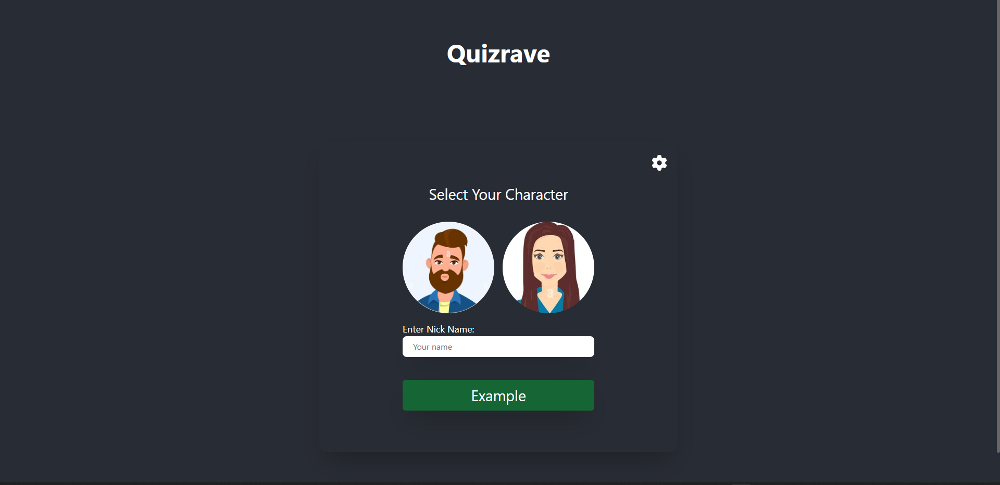
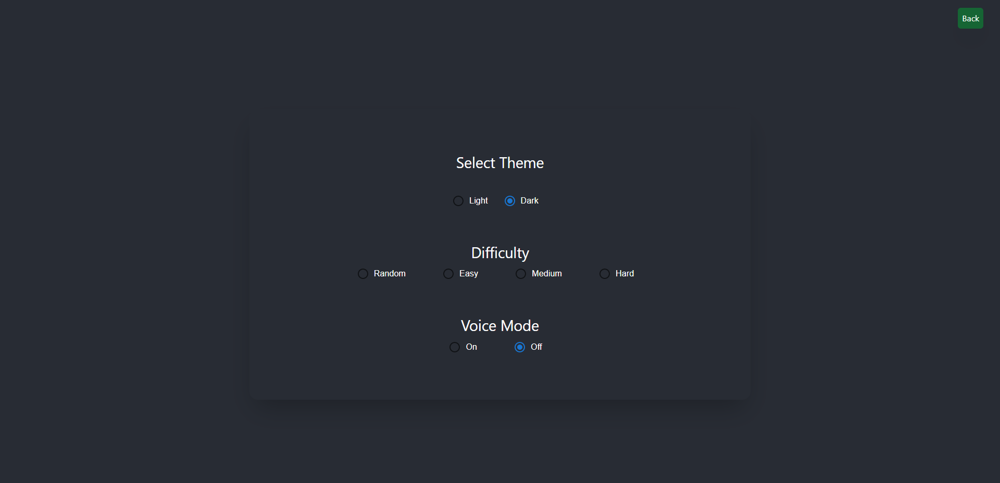
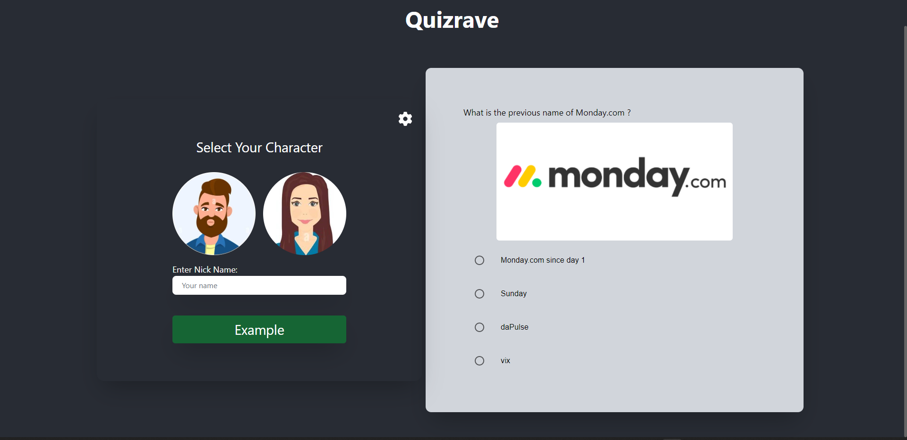
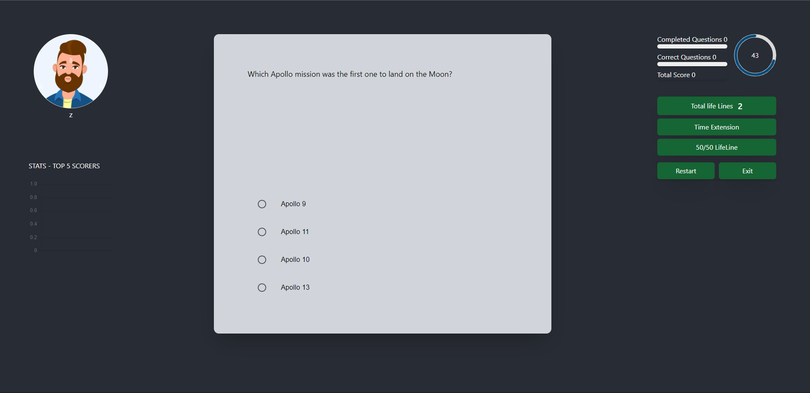
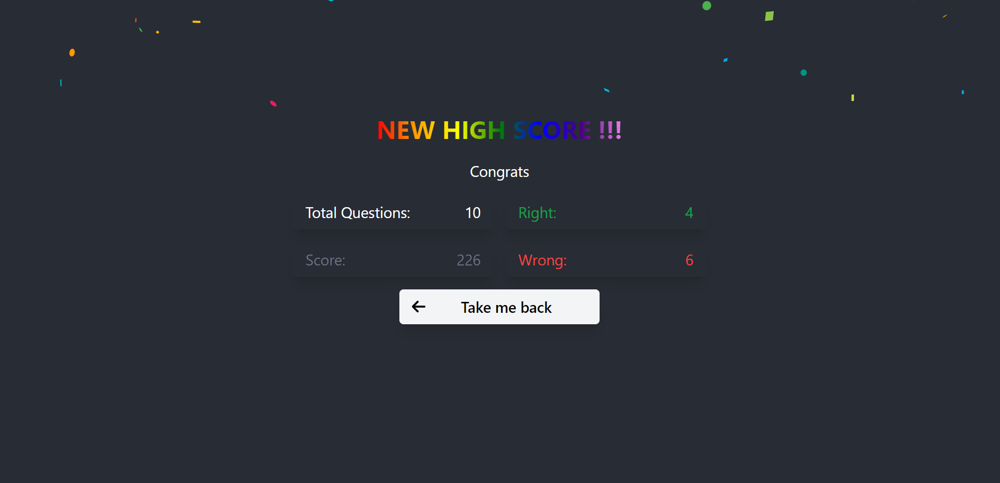

# Contents

- [Overview](#overview-)
- [Game Functionality](#functionality-)
- [Game Description](#description-)
- [Technologies](#technologies-)
- [ScreenShots](#ScreenShots-)
- [Videos](#videos-)

 

# Overview 👋

Quizrave is a web game for curious people.
Try to answer 10 questions correctly and quickly and see what you are capable of!
10 questions, 1 min  each.

Let's see if you can get to 600 points (;

> **You can take a look at the backend repo [here](https://github.com/shalevsh/create-react-app-lambda/tree/master/src)**

> **Go to [Website](https://astounding-kitsune-b5bb08.netlify.app/)**

 

# Game Functionality 

> * Main screen - choose your character.

> * Settings - choose light\dark mode, difficullty level, voice mode (enables text to speech).

> * Stats - dynamic chart of top 5 scorers.

> * Animation, Propper celebration.

> * Progress bar of completed questions and correct questions.

> * Life Lines - 50/50 option, time extension.

> * Restart / quit game while game is running.

> * Save settings after refresh.

> * New high score feature (shows only if user earn good score).
 

# Game Description

quizrave is a web game -
Quiz with 10 questions, you can set the difficulty level in the settings.

* Definitions -

You can choose darkmode, lightmode.
You can choose the difficulty level of the game - easy, meduim, hard.
You can choose voice mode - a setting that allows narration of the question and accompanying answers.

* The game-

Write down the user's nickname and choose male or female.
Once the character is selected the game begins.
The score is calculated according to the time left and whether the answer is correct.
If the answer is incorrect - 0 points.
If the answer is correct the total points will be as the amount of time.
In addition, there is an indication of the character regarding the correctness of the question according to the facial look.
The game has a statistics chart of the top 5 players who played - the information is stored in local storage (allows the user to strive to overtake the top contenders).
Image- I tried to implement using a googl api a relevant image regarding each question.
Sometimes it worked well and sometimes it didn't.
So I decided to put the code in a comment and submit that this feature is not displayed.

* Results -
The results screen shows the number of correct answers, the number of incorrect answers.
The results screen has a coordinated celebration about the result the user has earned.
According to the result there is a title that corresponds to the number of points, the amount of confetti will be accordingly.
When the number of points above 500 will be written Perfect game!
When the number of points above 400 will be written Amazing!
When the number of points above 200 will be written Congrats!
Otherwise it will say Go back to school
If the user has achieved a result of 200 points or more, and this is a new record, this will also be indicated on the results screen.

# Technologies 👨‍💻

# Screenshots 🎮

 

 

 

 

 

# Video 🎥

